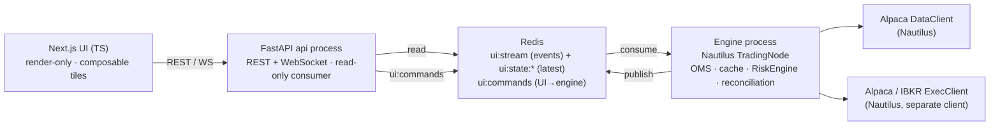
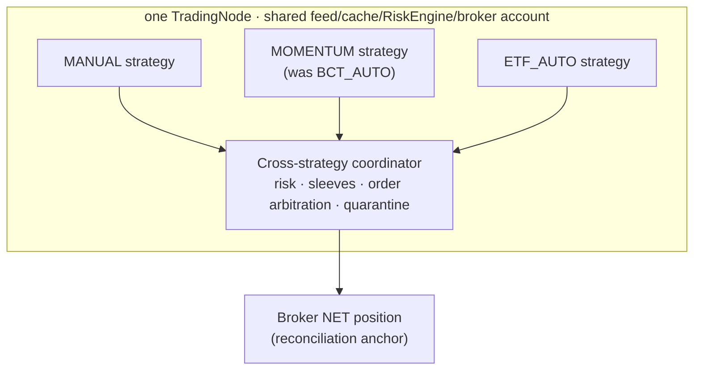

# ARCHITECTURE — kumo-cockpit

> Living document. Populated during work sessions. Diagrams in Mermaid.

## System overview
Two processes bridged by Redis (issue #20). The engine owns state; the api is a **read-only consumer**; the UI
is render-only.

The UI bus is **display-only and droppable** — authoritative state (positions, cycles, reconciliation) lives in
the engine, never reconstructed from `ui:stream`. Data + exec are **separate Nautilus clients** (broker swap
never loses data).

## Strategies + execution ownership
Vocab: **strategy** (was "lane") = STYLE + capital sleeve + Nautilus `StrategyId` + management mode. See
`docs/adr/0001-execution-ownership-strategy-model.md` (GH #72) and the data-model epic #68.

- **Per-strategy Nautilus strategies + a coordinator** (not a master strategy): NETTING position id
  `{instrument}-{strategy_id}` natively gives each strategy its own net position + per-leg P&L.
- **Broker net = the only hard reconciliation anchor**; per-strategy split is unverified by the broker;
  external/manual activity → claim/quarantine.
- **Trade cycle** (open→closed, spans flats; HELD/ARMED/WATCH/CLOSED) = an **engine projection** above native
  positions; P&L derived from native (never a parallel ledger); durable `cycle_id`. Canonical identity =
  `(account_id, client_id, instrument_id, strategy_id, cycle_id)`.

## Data contract
Backend emits OpenAPI → generated TS client. UI subscribes to WS topics (bars/quotes/fills/positions/account)
— no polling. Phase 2 adds an engine-authored `TradeCycleDTO` (managed book); the UI must **not** derive cycles
from `PositionDTO` or the stream.

## To be filled
- Action/manager execution model (trigger→condition→order; native vs engine leash) — #55/#50.
- Capital-sleeve allocation + working-order reservation per strategy — #80.
- Tile/Data-Source registry wiring — #29.
